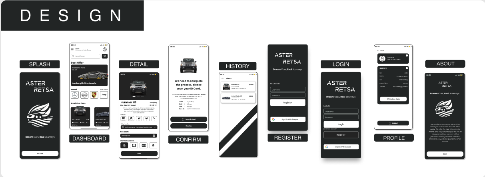

# Aster Car Rental 2023

Repository untuk tugas besar mata kuliah Pemrograman Mobile Semester 5 tahun 2023.

## Tentang Aplikasi
Aplikasi Aster Car Rental adalah platform penyewaan mobil yang memudahkan pengguna dalam mencari, memesan, dan mengelola penyewaan mobil. Aplikasi ini dirancang untuk memberikan pengalaman pengguna yang nyaman dan efisien dalam menyewa mobil.

## Anggota Kelompok
1. Arya Wicaksana Hidayat (2141720207)
2. Bahtiar Rifa'i (2141720068)
3. Patria Anggara Susilo Putra (2141720058)
4. Salma Annissa Azizi (2141720137)
5. Shofiatul Ayu Anikaningrum (2141720048)

## Tangkapan Layar

## Layar dan Penanggung Jawab

| No. | Nama Layar    | Fitur | PIC                         |
|-----|---------------|-------|-----------------------------|
| 1   | Splash        | -     | Patria Anggara Susilo Putra |
| 2   | Dashboard     | -     | Patria Anggara Susilo Putra |
| 3   | Detail        | -     | Bahtiar Rifa'i              |
| 4   | Confirm Page  | -     | Bahtiar Rifa'i              |
| 5   | History       | -     | Arya Wicaksana Hidayat      |
| 6   | Scan ID Card  | -     | Arya Wicaksana Hidayat      |
| 7   | Register      | -     | Salma Annissa Azizi         |
| 8   | Login         | -     | Salma Annissa Azizi         |
| 9   | Profile       | -     | Shofiatul Ayu Anikaningrum  |
| 10  | About         | -     | Shofiatul Ayu Anikaningrum  |

## Desain Figma

## Fitur Unggulan
- Fitur history atau riwayat pemesanan.

## Kredit
1. [Flaticon](https://www.flaticon.com/)
2. [Icons8](https://icons8.com/icons)
3. [1000logos](https://1000logos.net/)

